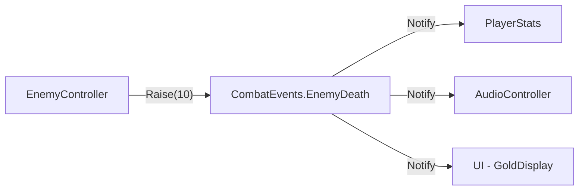
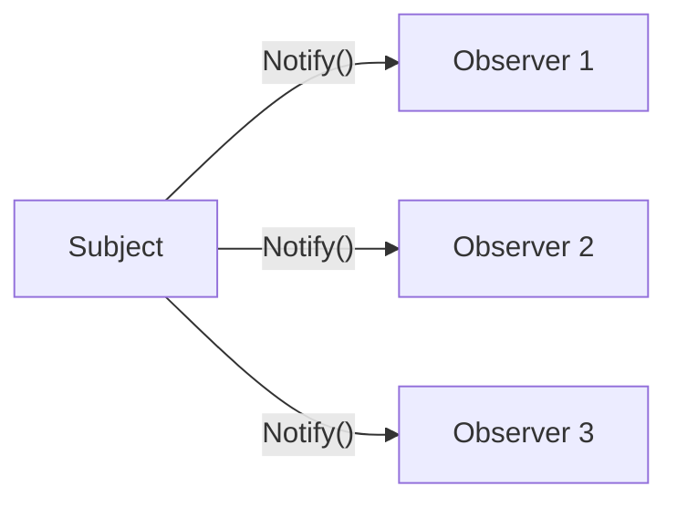
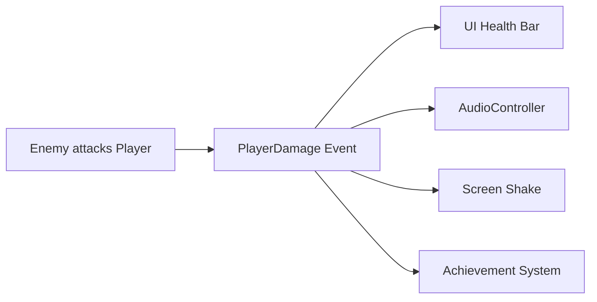

# Pure C# Event Channels

---

## Overview

Pure C# Event Channels are a programmer-friendly architecture pattern for decoupled communication in Unity.

They still follow the observer pattern, but instead of relying on ScriptableObject assets in the Inspector, events are handled through plain C# channel classes.  
This allows systems to communicate through shared channel instances in code, reducing direct dependencies while keeping event flow explicit and type-safe.

Since if it Pure C#, you will need to manually clear the channels in a MonoBehaviour script on destroy. However, this teaches you how to use event-driven architecture in more than just Unity projects since you are creating everything yourself and not relying on Unity specific components.

You can use this architeture pattern easily in other languages and engines as well as software development.

---

## Tutorial Video
<iframe width="560" height="315" src="https://www.youtube.com/embed/ejtV4dVET6w?si=onPdHSkgOe-gzGUw" title="YouTube video player" frameborder="0" allow="accelerometer; autoplay; clipboard-write; encrypted-media; gyroscope; picture-in-picture; web-share" referrerpolicy="strict-origin-when-cross-origin" allowfullscreen></iframe>

---

## Recommended Experience

Pure C# Event Channels are usually an early-intermediate architecture topic and a natural next step after delegates/events.

I recommend having a base understanding of:

- Unity Components and Lifecycle (Awake, OnEnable, OnDisable)
- C# Delegates and Events
- Basic code architecture and shared registries

---

## Using Pure C# Event Channels

### Why Use It?

<div class="grid cards" markdown>

- :material-access-point:{.lg .middle} __Decoupling Systems__
  
  ---
  
  Broadcasters and listeners can communicate without hard references to each other.
  
- :material-account-group-outline: __One to Many Communication__
  
  ---
  
  A single raised event can notify multiple systems (UI, audio, VFX, state, etc).
  
- :material-tools: __Lightweight Setup__
  
  ---
  
  No ScriptableObject assets required, just shared C# channel instances.
  
- :material-bell: __Reusable Architecture__
  
  ---
  
  Generic and non-generic channels can be reused across many features with consistent APIs.

</div>

---

### Common Use Cases

Some common use cases for Pure C# Event Channels include:

- Raising a player damage event to update UI and trigger feedback.
- Broadcasting pause/resume state changes.
- Publishing game state transitions to multiple systems.
- Triggering victory/defeat sequence requests from gameplay systems.

---

### Beginner Method Replacement

A beginner approach often uses:

- Direct serialized references between many scripts.
- Large manager/singleton dependency chains.
- Static events spread across unrelated classes.

Pure C# Event Channels replace those patterns by centralizing communication into shared channel objects and registries.

---

### When Not to Use Pure C# Event Channels

Pure C# channels are powerful, but not always necessary.

Avoid this approach when:

- Designers need to wire events directly in the Inspector.
- You specifically want asset-based event definitions across scenes.
- Very local communication on the same object is enough (GetComponent<>() is simpler).

---

## Pure C# Event Channel Diagram

Below is a sample setup for a player damage flow using a typed C# channel:



The enemy raises the death event with a gold reward payload. Multiple listeners — player stats, audio, and UI — all respond independently. None of them know about each other or the enemy.

---

## Observer Pattern Implementation with C# Event Channels

### EventChannel — void signal

A signal-only channel for events that don't carry data:

```csharp
using System;

namespace Events
{
    public class EventChannel
    {
        private event Action Handlers;

        public void Raise() => Handlers?.Invoke();
        public void Subscribe(Action handler) => Handlers += handler;
        public void Unsubscribe(Action handler) => Handlers -= handler;
        public void Clear() => Handlers = null;
    }
}
```

### EventChannel\<T\> — typed payload

A generic channel that carries a payload when raised:

```csharp
using System;

namespace Events
{
    public class EventChannel<T>
    {
        private event Action<T> Handlers;

        public void Raise(T value) => Handlers?.Invoke(value);
        public void Subscribe(Action<T> handler) => Handlers += handler;
        public void Unsubscribe(Action<T> handler) => Handlers -= handler;
        public void Clear() => Handlers = null;
    }
}
```

### Event Registries

Registries group related channels together so systems can find them through the service locator:

```csharp
namespace Events.Registries
{
    public class CombatEvents
    {
        public readonly EventChannel<int> EnemyDeath = new();
        public readonly EventChannel<int> EnemyReachedEnd = new();
        public readonly EventChannel EnemyDamaged = new();

        public void Clear()
        {
            EnemyDeath.Clear();
            EnemyReachedEnd.Clear();
            EnemyDamaged.Clear();
        }
    }
}
```

```csharp
namespace Events.Registries
{
    public class GameEvents
    {
        public readonly EventChannel TowerPlaced = new();
        public readonly EventChannel GamePaused = new();

        public void Clear()
        {
            TowerPlaced.Clear();
            GamePaused.Clear();
        }
    }
}
```

```csharp
namespace Events.Registries
{
    public class WaveEvents
    {
        public readonly EventChannel<int> WaveStarted = new();
        public readonly EventChannel WaveCompleted = new();
        public readonly EventChannel AllWavesCompleted = new();

        public void Clear()
        {
            WaveStarted.Clear();
            WaveCompleted.Clear();
            AllWavesCompleted.Clear();
        }
    }
}
```

```csharp
namespace Events.Registries
{
    public class EconomyEvents
    {
        public readonly EventChannel<int> GoldChanged = new();
        public readonly EventChannel<int> LivesChanged = new();

        public void Clear()
        {
            GoldChanged.Clear();
            LivesChanged.Clear();
        }
    }
}
```

### Broadcaster — raising events

Any system can raise events through the registry channels:

```csharp
// In EnemyController.OnDeath():
Services.Get<CombatEvents>().EnemyDeath.Raise(GoldGiven);

// In WaveManager when all waves done:
Services.Get<WaveEvents>().AllWavesCompleted.Raise();
```

### Listener — subscribing and unsubscribing

MonoBehaviour listeners subscribe in OnEnable and unsubscribe in OnDisable:

```csharp
// In AudioController:
private void OnEnable()
{
    Services.Get<CombatEvents>().EnemyDeath.Subscribe(OnEnemyDeath);
}

private void OnDisable()
{
    Services.Get<CombatEvents>().EnemyDeath.Unsubscribe(OnEnemyDeath);
}

private void OnEnemyDeath(int goldReward)
{
    // Play death sound
}
```

### Cleanup — GameBootstrapper

Clear all registries on scene unload to prevent leaked subscriptions:

```csharp
private void OnDestroy()
{
    Services.Get<CombatEvents>().Clear();
    Services.Get<GameEvents>().Clear();
    Services.Get<WaveEvents>().Clear();
    Services.Get<EconomyEvents>().Clear();
    Services.Clear();
}
```

---

## Final Thoughts

Pure C# Event Channels are a practical evolution of the observer pattern for code-first Unity architectures.

You keep the flexibility of events, gain cleaner decoupling, and maintain explicit control over event flow without relying on ScriptableObject assets.
As your project grows, small feature-based registries help keep communication organized and scalable.

This was just a basic intro with sample data and code.  
If you are new to events, check out the observer pattern tutorial.  
If you want Inspector-driven event wiring for designers, check out ScriptableObject Event Channels.

---

# Observer Pattern — Foundation

---

## Purpose

How to decouple systems through events instead of direct references.

---

## What Is the Observer Pattern?

The observer pattern is a behavioural design pattern where an object (the subject) notifies a list of dependent objects (observers) when its state changes — without any of them needing direct references to each other.

It enables **one-to-many communication**: one event fires, many listeners respond. Neither side knows the concrete type of the other.



---

## Why It Replaces Hardcoded References and Singletons

Without the observer pattern, systems communicate by:

- **Direct references:** Script A holds a serialized reference to Script B and calls methods on it directly. Every new listener means editing Script A.
- **Singletons:** A global manager that everything calls. Tight coupling to a single instance, hard to test, hard to replace.
- **Hardcoded chains:** Script A calls B which calls C. Changing the order or adding a step means modifying call chains.

The observer pattern replaces these with a **subscribe-and-notify** model. The subject doesn't know who's listening or how many listeners exist. Listeners decide what they care about.

---

## Observer Pattern Flow — Player Damage Example

This diagram shows the traditional observer pattern flow for a player taking damage:



One event — four independent systems respond. None of them reference each other.

---

## Simple C# Event Example

The most basic observer pattern in C# uses the built-in `event` keyword:

```csharp
public class PlayerHealth
{
    public event Action<int> OnDamageTaken;

    public void TakeDamage(int amount)
    {
        OnDamageTaken?.Invoke(amount);
    }
}

public class HealthBarUI
{
    public HealthBarUI(PlayerHealth health)
    {
        health.OnDamageTaken += UpdateDisplay;
    }

    private void UpdateDisplay(int damage)
    {
        // Update the health bar
    }
}
```

This works — but `event` declarations are tied to the class that owns them. You can't share an event across unrelated systems without making both systems reference the same object. That's where Event Channels come in: they pull the event out of the subject and into a shared channel object.

---

## Unity Lifecycle and the Observer Pattern

When using events in Unity, you must respect the MonoBehaviour lifecycle:

- **Subscribe in OnEnable** — not Awake. Awake runs once; OnEnable runs every time the object is activated. If a GameObject is disabled and re-enabled, Awake won't fire again but OnEnable will.
- **Unsubscribe in OnDisable** — not OnDestroy. OnDisable fires before OnDestroy and covers scene unloads. If you only unsubscribe in OnDestroy, other objects that get destroyed first may try to invoke a dead reference.
- **Clear channels on scene transition** — static or service-located channels survive across scenes. Always call `Clear()` on registries in your GameBootstrapper cleanup to prevent stale subscriptions.

```csharp
private void OnEnable()
{
    Services.Get<CombatEvents>().EnemyDeath.Subscribe(OnEnemyDeath);
}

private void OnDisable()
{
    Services.Get<CombatEvents>().EnemyDeath.Unsubscribe(OnEnemyDeath);
}
```

Missing the unsubscribe step causes **leaked subscriptions** — the channel still holds a reference to the destroyed object, resulting in NullReferenceExceptions when the event fires next.

---

## From Observer Pattern to Event Channels

The Pure C# Event Channels pattern above is the observer pattern, re-structured for Unity projects:

| Observer Pattern Concept | Pure C# Event Channel Equivalent |
|---|---|
| Subject | `EventChannel` / `EventChannel<T>` instance |
| Notify | `Raise()` |
| Attach (subscribe) | `Subscribe()` |
| Detach (unsubscribe) | `Unsubscribe()` |
| Concrete subject | A registry class (`CombatEvents`, `WaveEvents`) |

The channel **is** the subject — it just exists as a standalone object instead of being embedded inside a class. This means any system can raise or subscribe to it through the shared registry, without creating direct dependencies.